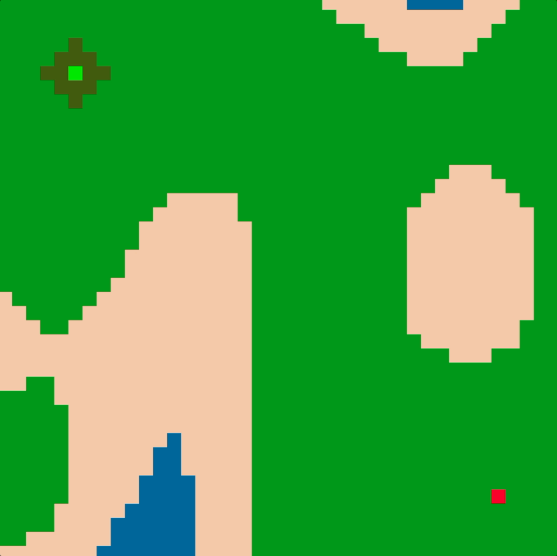
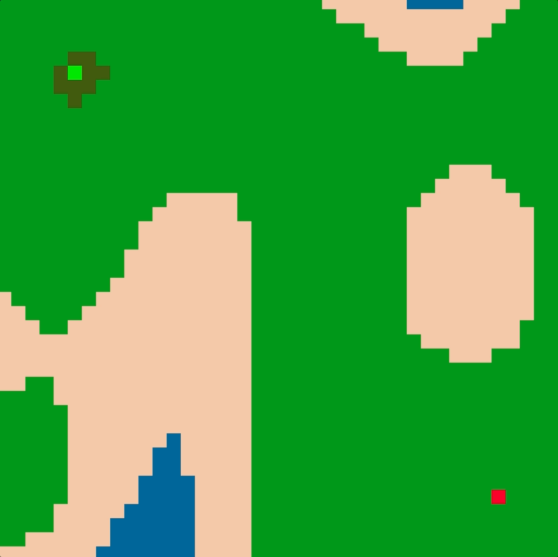

# Pathfinding Example

Example implementing of [breadth-first search](https://en.wikipedia.org/wiki/Breadth-first_search), [depth-first search](https://en.wikipedia.org/wiki/Depth-first_search), and [A*](https://en.wikipedia.org/wiki/A*_search_algorithm). Terrain is generated with [perlin noise](https://en.wikipedia.org/wiki/Perlin_noise) and visualized with [raylib](https://www.raylib.com/index.html).

## Set Up and Running

```
mkdir build
cd build
cmake ..
cmake --build . --parallel
./pathfinding-example
```


## Examples
### Depth-First Search


### Breadth-First Search


### A*

